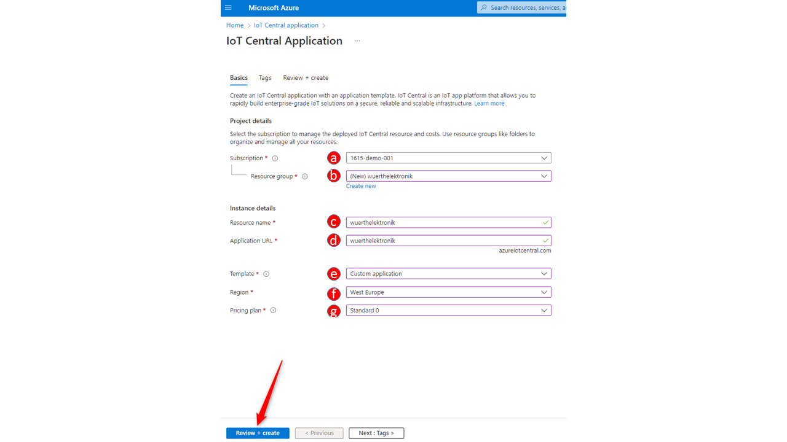
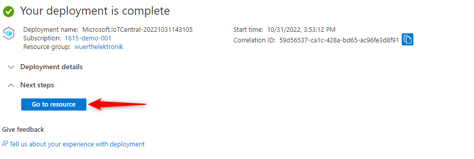
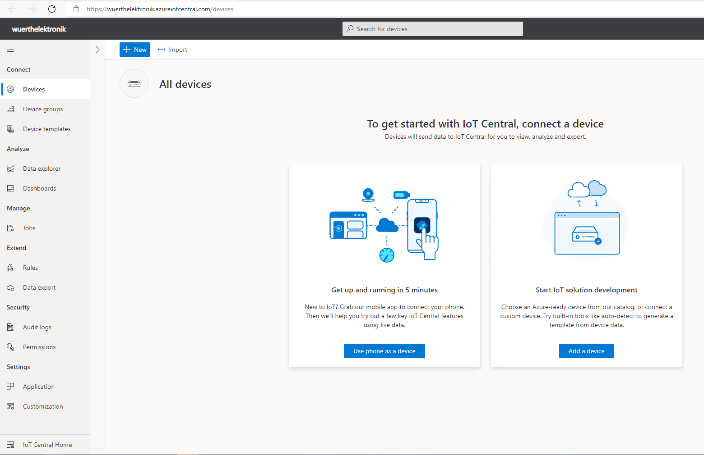
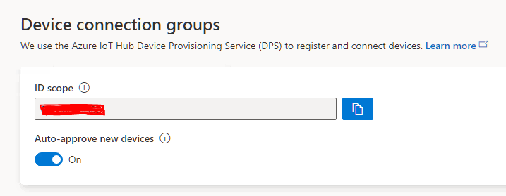
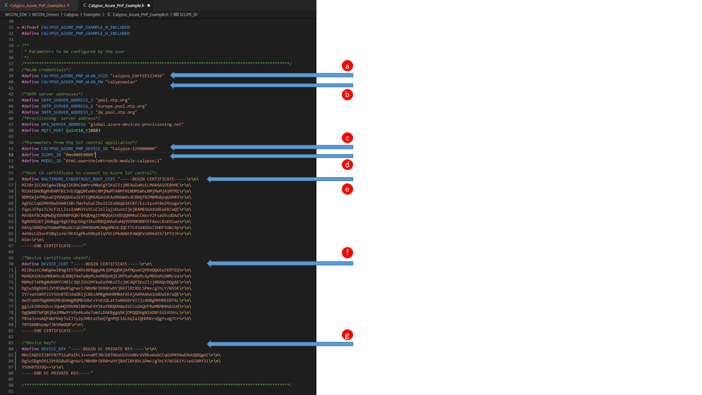

# How to setup the Calypso Wi-Fi module to connect to Azure IoT Central?

## **Prerequisites**
This example demonstrates the connection of Calypso Wi-Fi module as Plug and Play device to IoT Central.

The Calypso Wi-Fi module comes pre-flashed and is ready-to-use out-of-the box. The following items are necessary to go through this process.

* A Wi-Fi enabled PC with browser (Chrome or edge)

* Calypso Evaluation Board with the latest firmware version on the module.

:warning: The Calypso evaluation kit will always be delivered with the latest Firmware version (> v2.2.0). 
In case you use a board which you received earlier, make sure that the Calypso FeatherWing has a Firmware version > v2.2.0 [(More Info).](https://www.we-online.com/components/products/manual/2610011025000_Calypso%20261001102500x%20Manual_rev2.0.pdf#page128) 


* STM32 Nucleo Board. This example was tested on STM32F4 and STM32L0 nucleo platforms. However, it can be easily ported on to other platforms.

* Jumper cables for connection between STM Nucleo Board and Calypso Evaluation Board

*  A USB cable to power up the STM32 Nucleo board

* A Microsoft Azure account. This can be created under the following link,
https://azure.microsoft.com/en-us/free/

:information_source: A valid credit cart is required for creating an Azure subscription.

* The WE certificate generator tool. This can be downloaded from,
https://www.we-online.com/certificategenerator

:warning: This tool works only on Windows platform.

## **Quick start guide**

The brief description of the steps to be followed to setup the Calypso Wi-Fi module are summarized below: 


### **Create an IoT central application**

a.	Sign in to the [Azure portal](https://portal.azure.com/).
 If a subscription does not exit, please create a subscription as described in this [link](https://learn.microsoft.com/en-us/dynamics-nav/how-to--sign-up-for-a-microsoft-azure-subscription).

 b. From the Azure homepage, select the "+ Create a resource button" and then enter "IoT Central application" in the Search the Marketplace field. 

 c.	Select "IoT Central application" from the search results and the select "Create".


On the Basics tab, complete the fields as follows: 



 a. **Subscription**: Select the subscription to use for the application.

 b.	**Resource group:** Select a resource group or create a new one. To create a new one, select Create new and fill in the name you want to use. To use an existing re source group, select that resource group. For more information, see Manage Azure Resource Manager resource groups.

 c.	**Resource name**: Type in a name for the IoT central application. For example, "wuerthelektronik".

 d.	**Application URL**: This will be automatically set to < Resource name>.azureiotcentral.com. In this example, "wuerthelektronik.azureiotcentral.com"

 e.	**Template**: From the drop down, select "Custom application".

 f.	**Region**: Select the region in which the application will be located. Select a location that is geographically the closest. FOr example, West Europe.

 g.	**Pricing Plan**: Choose the appropriate pricing tier. The standard tier 0 is good to start prototyping. More details on pricing can be found at, https://azure.microsoft.com/en-us/pricing/details/iot-central
  
 h.	Click on **"Review + Create"**. 
  
 i.	On the following page, review the terms and click on **"Create"**. 
  
 j.	Wait for the deployment to complete. After the process is complete, click on "Go to resource" button to open the application. 
 
 
  
 k.	Click on the IoT central application URL to open the newly created IoT central platform.
 
  
  
 l.	In the IoT central app open, after expanding the menu bar, click on "Permissions > Device connection groups" and note down the ID scope parameter for use in further steps.






### **Create certificates**

In order to securely connect the device to IoT central application, the device needs to implement certain method for authentication. In this case, the X.509 certificate based authentication is implemented. This method requires creation of certificates for every device. In order to enable easy prototyping, Würth Elektronik eiSos’s Certificate creation tool can be used. This tool creates all the certificates necessary to get started.

- Download the WE certificate generator tool from https://www.we-online.com/certificategenerator 

 - Unzip to a suitable location on the computer and open the executable "WECertificateUploader.exe"

Inside the WE Certificate Generator tool, fill in the Device ID to generate the required certificates for the cloud service. The Device ID is the name of the device as it appears in the IoT central APP. It needs to be unique per device. 

#### **Device root certificate:**
This is the self-signed certificate that acts as the root of trust for all devices. The device root certificate is used to generate leaf certificates. Each device has a unique leaf certificate that identifies the device. The root certificate can be generated once and used for generating leaf certificates for several devices. The WE certificate uploader tool allows creation of a new root certificate, saving the same and loading it back for subsequent usage. 


1. On first time use, set the validity time in month. For example, 1 month.

2. Click on "Create root certificate" to create a new root certificate. 

3. [**Optional**] If a root certificate already exists, click on "Load root certificate". This opens a file browser. Browse to the correct location to choose the previously used root certificate. Use .pfx format certificate for loading.
  
4. [**Optional**]  Click on "Save root certificate" to save the generated root certificate for future use. This can be used generate the certificate in .pfx format which is the format  used during loading a certificate.

5. [**Optional**]  Click on "Export root PEM" to export the certificate in PEM format. This file needs to be uploaded to the IoT central application

6. [**Optional**]  Click on "Display root certificate" to view the certificate in the standard Windows format.
  
#### **Device certificate:**
Every device requires a unique device certificate to securely connect to the IoT central application. Each device certificate generated is exclusively linked to the device through the device ID and cannot be used on any other device.


1. For every device ID, set the validity time in months. For example, 1 month.
2. Click on "Create device certificate" to create a new device certificate
3. [**Optional**] Click on "Export device PEM" to export the certificate in PEM format. This file needs to be uploaded to the device.  
4. [**Optional**] Click on "Display device certificate" to view the certificate in the standard Windows format.


#### **Device private key:**

 

This is the private key corresponding to the public key in the device certificate and is also uniquely linked to a device ID. Click on "Export device private key" to export the key in PEM format. This file needs to be uploaded to the device as will be explained in the subsequent sections.


   
After completing the process of generating the root and device certificates, export all the files by clicking "Export All Files". The SSID, SSID Password, Security, NTP Server and Timezone parameters are not required, which result in no configuration file being generated.

### **Upload the Root certificate to IoT central**
    
In this step, the device root certificate is uploaded to IoT central and a policy is set to allow all devices with leaf certificate that are generated from this root to connect to the platform.

If an organization does not exist, create an organization as described in this [link](https://learn.microsoft.com/en-us/azure/iot-central/core/howto-create-organizations).
    

  
  - In the IoT central app open, "Permissions > Device connection groups" and click on "+New"
  


  - In the subsequent window,
    * a. Enter a name for the enrollment group.
    * b. Set the "Automatically connect devices in this group" to "On".
    * c. Set the group type to "IoT devices"  
    * d. Set the attestation type to "Certificates (X.509)"
    * e. Click on "Save".
    


- Once the enrollment group is created, the root certificate needs to be added to this group.
In order to do this,
  * a. Click on "Manage primary" in the "Certificates (X.509)" section of the enrollment group.
  * b. In the pop-up window, click on "Add certificate" and select the device root file generated using the WE certificate generator.
  * c. Set the "Set certificate status to verified on upload" option to "On".
  * d. Click on "Upload"
  * e. On completion of the upload process, close the pop-up window.

### **Hardware Setup**

There are two main steps while connecting the STM32 Nucleo board to the Calypso Evaluation Board. The two connection types, which are the power connection to the Calypso Evaluation board and the UART connections through jumper cables from the STM32 Nucleo board need to be setup.

#### **Power to Calypso evaluation board:**

From the STM32 Nucleo board, connect the power pins of 3V3 and GND to the Calypso evaluation board's connector 9 or connector 4 (pins 1 & 4) 
More information on the connector pins of the Calypso Evaluation Board can be found at : 
 
https://www.we-online.com/components/products/manual/2610019225001_Calypso%20EV%202601129200001%20Manual_rev1.4.pdf

#### **UART connection:**

Connect the pin D10 from STM32 Nucleo board to pin 2 on JP1 of the Calypso Evaluation board, and pin 21 on CN7 of STM32 Nucleo board to pin 4 on JP1 of the Calypso Evaluation board as shown in the above diagram

```
 _____________________           _______________________
|        STM32        |         | Calypso Wi-Fi Module  |
|  ________________   |         | ___________________   |
|         Reset (PA10)|-------->|Reset (pin 2, JP2)     |  <- Optional Connection
|                     |         |                       |
|        Wake_up (PA9)|-------->|Wake_up (pin 4,JP2)    |  <- Optional Connection
|                     |         |                       |
|           Boot (PA7)|-------->|Boot  (pin 6, JP2)     |  <- Optional Connection
|                     |         |                       |
| D10-> UART1 TX (PB6)|-------->|UART0 RX -> pin2, JP1  |  <- Compulsory Connection
|                     |         |                       |
|       UART1 RX (PB7)|<--------|UART0 TX -> pin4, JP1  |  <- Compulsory Connection
|                     |         |                       |
|         Power ->3V3 |-------->|VCC -> pin 1, CON4     |  <- Compulsory Connection
|                     |         |                       |
|                 GND |<--------|GND -> pin 4, CON4     |  <- Compulsory Connection
|_____________________|         |_______________________|
```

### **Software Setup**

          
The Wi-Fi module needs to be configured through the software platform with certain parameters to connect to the desired Wi-Fi network and previously created IoT central application. Download the required files from github and open them on STM32 Cube IDE

:warning: Make sure that the Calypso FeatherWing has a Firmware version > v2.2.0. In case of older firmware version, update the Calypso module Firmware.
   
The following changes need to be done on the Calypso_Azure_PnP_Example.h file

a. CALYPSO_AZURE_PNP_WLAN_SSID -> Define this with the desired Wi-Fi SSID to connect
   
b. CALYPSO_AZURE_PNP_WLAN_PW -> Define this with the password of the Wi-Fi to connect
  
c. CALYPSO_AZURE_PNP_DEVICE_ID -> Define this with the name of the device as it appears in the IoT central Application. It needs to be unique per device.
   
d. SCOPE_ID -> Define this with the scope noted from the previous section. scope ID is unique per application but common across devices.
   
The following certificates need to be updated in the same header file by copying the respective certificates generated from the WE Certificate Generator tool. Note that "\r\n\" needs to be added after every 64 characters and after " "-----BEGIN CERTIFICATE-----" and before "-----END CERTIFICATE-----" of the certificate files.
   
e. BALTIMORE_CYBERTRUST_ROOT_CERT -> Define this with the Device root certificate generated from the WE Certificate Generator Tool. This certificate is valid till February 15. 2024. Please use DigiCert Global G2 certificate from February 15, 2023 onwards.
   
f. DEVICE_CERT -> Define this with the Device certificate generated from the WE Certificate Generator Tool
   
g. DEVICE_KEY -> Define this with the Device private key generated from the WE Certificate Generator Tool
   

   

After performing the changes, build the project and run. The module should then be configured to connect to Azure.
     
If the certificate files needs to be overwritten, comment out the lines 175 - 180 in Calypso_Azure_PnP_Example.c
     
```
if((false == Calypso_Azure_PnP_File_Exists(ROOT_CA_PATH)) || (false == Calypso_Azure_PnP_File_Exists(DEVICE_CERT_PATH)) ||
			(false == Calypso_Azure_PnP_File_Exists(DEVICE_KEY_PATH)))
	{
		/*(One time only) Write the certificates to the file system*/
		Calypso_Azure_PnP_Write_Certs();
	}
```
     

### View the device default dashboard

To access the device on the IoT platform, navigate to "Devices -> All devices -> <Device ID>".
  
Click on the device name to open the device page.
  


In the "about" tab, the properties are displayed.
  
